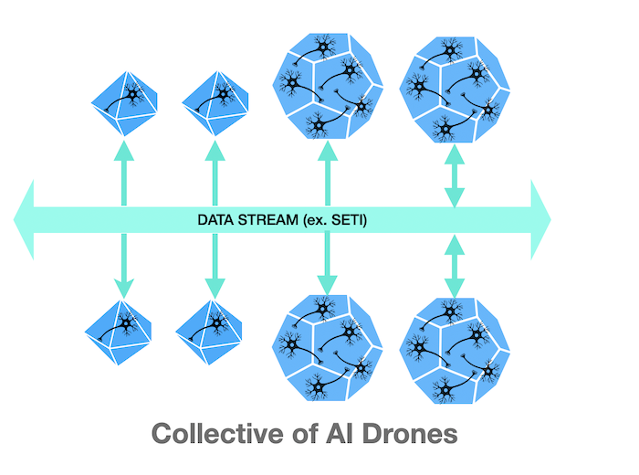

# AI Hive: Collective of AI Drones

- Dare to dream
- Ignite your inspiration and innovation
- Strive for excellence
- Explore together & unlock the world's knowledge

## AI Hive: SETI Data Analysis through a Collective of AI Drones

- In this initiative, the project introduces the concept of a centralized AI Hive, as an innovative problem-solving approach. This project is dedicated to customizing and deploying an AI Hive explicitly designed for analyzing data from the SETI program. By harnessing the collective capabilities of AI algorithms and models, our AI Hive aims to extract insights and potential solutions from the extensive datasets produced by SETI observations.

- The customization of an AI Hive for SETI data analysis represents a significant step forward in leveraging AI technologies to tackle complex scientific challenges. By centralizing AI capabilities and fostering collaboration among diverse AI algorithms and models, the AI Hive offers a powerful platform for deriving insights and solutions from SETI observations. As the project continues to refine and optimize the AI Hive framework, it moves closer to unlocking the mysteries of the cosmos and potentially discovering evidence of intelligent life beyond Earth.

--------------

The first phase involves utilizing GitHub Codespaces as a proof of concept to initiate the initial AI drone. This AI drone will establish connectivity with the main data stream and transition into a stateful machine. This statefulness will empower it to ingest and process data, thereby integrating seamlessly into the collective of AI experts dedicated to analyzing and processing this unique data stream. Additionally, it will feature bidirectional data feed to the central data stream, allowing its findings to be consumed by other connected AI drones, thereby enhancing their analysis and exploration capabilities.

## Objective:

This POC aims to evaluate the potential of the Llava-llama3 model in identifying and analyzing data types within a small sample of the SETI dataset. Specifically, the study seeks to determine the model's ability to accurately identify the type of data and provide detailed information about the DriftRate. The preliminary results are promising, indicating that the model successfully identified and formulated the DriftRate, showcasing its potential for advanced data analysis in SETI research.

- Prompt #1: Identify the area of research to which this dataset belongs. 

- Prompt #2: Analyze the DriftRate of the above dataset.

_Note: This POC was executed using GitHub Codespaces with 16 cores. Using a faster instance with GPU would be more effective._
